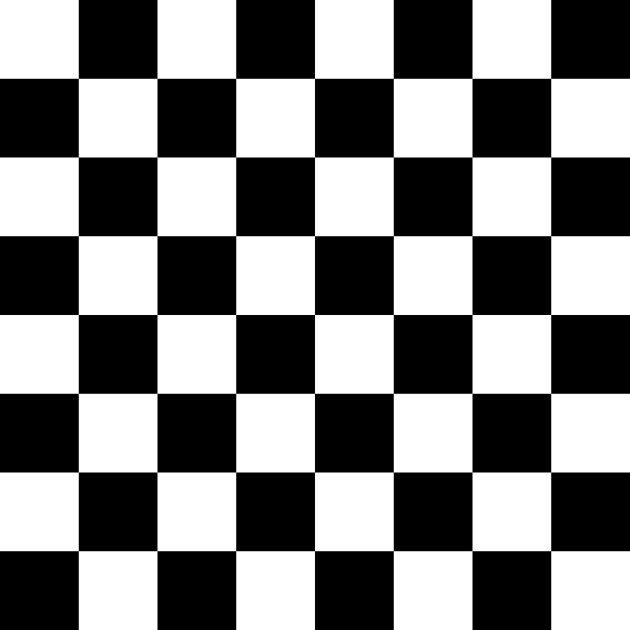
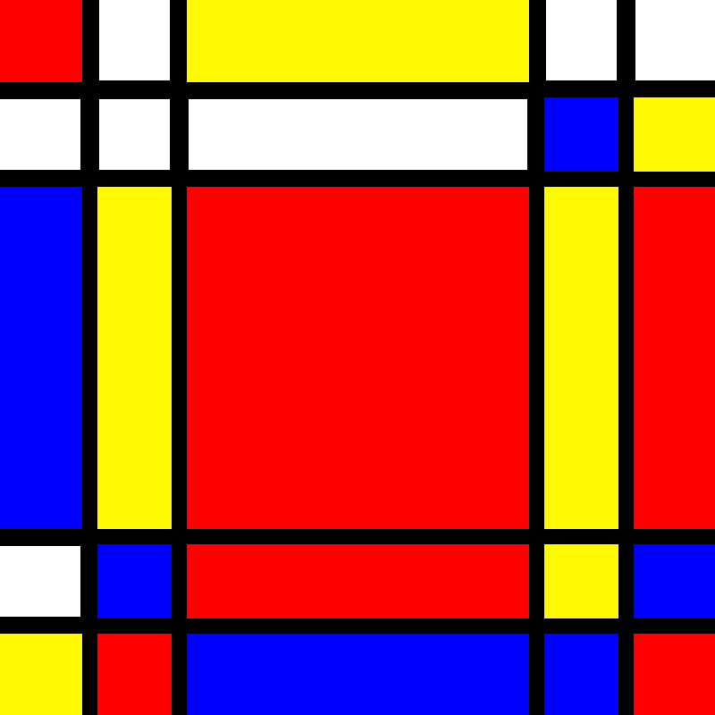

# VC_Practica_1

## Trabajo realizado.

En esta práctica se han trabajado los siguientes aspectos:
- Manipular imágenes
- Dibujar formas sobre imágenes mediante las funciones de dibujo de OpenCV
- Guardar imágenes en disco
- Modificar planos en imágenes
- Obtener imágenes de entrada vía webcam
- Identificar píxeles y regiones de píxeles con características relacionadas con la intensidad del brillo

## Lista de tareas realizadas

### TAREA 1: Crea una imagen, p.e. de 800x800 píxeles, con la textura del tablero de ajedrez.

En esta tarea se genera una imagen en escala de grises de 800x800 píxeles, dividiendo la superficie en 8 filas y 8 columnas.
Cada celda tiene un tamaño de 100x100 píxeles. Se rellenan de blanco únicamente las celdas alternas correspondientes, mientras que las restantes permanecen negras gracias al fondo inicial, creando así la textura de un tablero de ajedrez. Finalmente, la imagen se guarda en disco y se muestra en pantalla.
El resultado es el siguiente:

</img>

### TAREA 2: Crear una imagen estilo Mondrian (un ejemplo https://www3.gobiernodecanarias.org/medusa/ecoescuela/sa/2017/04/17/descubriendo-a-mondrian/ ) con las funciones de dibujo de OpenCV.

En esta tarea se crea una imagen cuadrada en blanco de 800 píxel por cada lado, y mediante el uso de funciones de opencv se añaden líneas negras y rectángulos rojos, amarillo y azules para generar una imagen de estilo Mondrian. Finalmente se escribe en disco y se muestra la imagen. A continuación la imagen resultado de ejecutar el código:

</img>

### TAREA 3: Modificar de forma libre los valores de un plano de la imagen.

En esta tarea se modifican los valores del canal rojo de la imagen capturada por la cámara:  

- Si el valor rojo es menor que 128 se pone a 0 (negro).  
- Si el valor rojo es mayor o igual a 128 se pone a 255 (blanco)

### TAREA 4: Pintar círculos en las posiciones del píxel más claro y oscuro de la imagen ¿Si quisieras hacerlo sobre la zona 8x8 más clara/oscura?.

#### Parte 1

Se toma la imagen proveniente de la cámara de vídeo y se busca la posicion del píxel de mayor y menor brillo, que se calcula como la suma de las componentes RGB, considerando el máximo si las 3 están a 255 y el mínimo si las 3 están a 0.
Posteriormente  se dibujan:
- Una circunferencia blanca alrededor del píxel más oscuro
- Una circunferencia negra alrededor del píxel más brillante

#### Parte 2

Se toma la imagen de la cámara de vídeo y se busca la zona 8x8 más brillante y oscura. Se considera que la zona más brillante es la zona que tiene mayor número de píxeles al valor máximo de la suma en sus tres componentes RGB, y la más oscura lo contrario. Cada imagen es reescalada hasta la mitad para disminuir el número de píxeles que se tratan y que no se ralentice tanto la imagen. Finalmente se dibujan:
- Rectángulos azules en la zona más brillante
- Rectángulos rojos en la zona más oscura

### TAREA 5: Llevar a cabo una propuesta propia de pop art.

En esta tarea se captura la imagen de la cámara y se organiza en una cuadrícula de 3x3.
Cada celda muestra el mismo fotograma con diferentes transformaciones de color, manteniendo la primera celda sin manipular.

## Requisitos de ejecución

Para poder ejecutar el cuaderno de la entrega se requiere utilizar mínimo la versión de python 3.11.5, y tener instaladas las librerías: 
- opencv-python
- matplotlib
- numpy

## Autoría 

- Tycho Quintana Santana. 
- Ian Samuel Trujillo Gil.

## Referencias a fuentes

- https://github.com/otsedom/otsedom.github.io/tree/main/VC/P1 
- https://numpy.org/doc/2.2/reference/generated/numpy.ndarray.sum.html
- https://docs.opencv.org/4.x/d6/d6e/group__imgproc__draw.html#gaf10604b069374903dbd0f0488cb43670
- https://docs.opencv.org/4.x/d6/d6e/group__imgproc__draw.html#ga07d2f74cadcf8e305e810ce8eed13bc9
